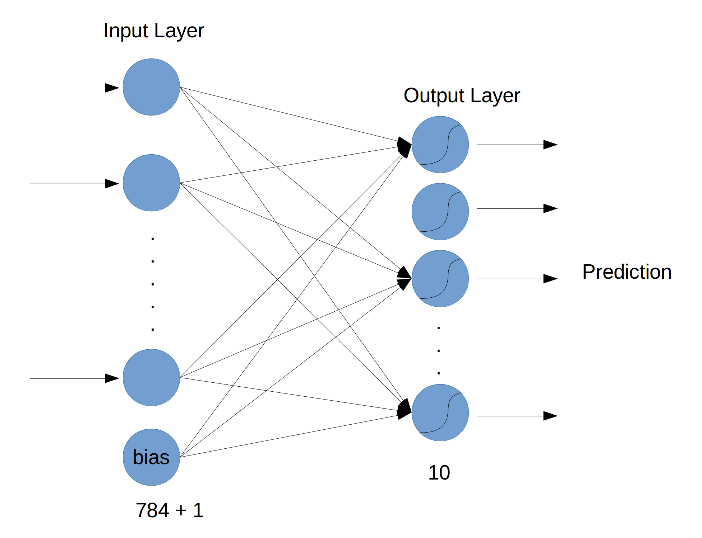

# Neural Net Demo for TDI
This is a quick introduction to ML with neural nets.

The Demo uses `Keras` which plugs into `tensorflow` but has a much lower
development time and gives comparable results.

Take a look at the [slides](slides.pdf) and then try the [interactive notebook](mnist_demo.ipynb).



# Installation

```
#cpu install
pip install tensorflow

#gpu install (probably doesn't work on mac)
pip install tensorflow-gpu

# after installing tensorflow
pip install keras
```
