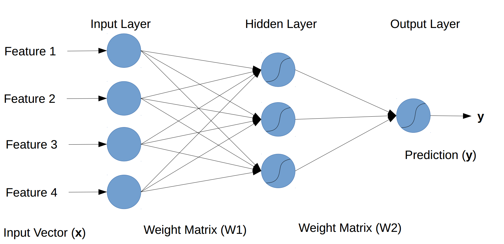
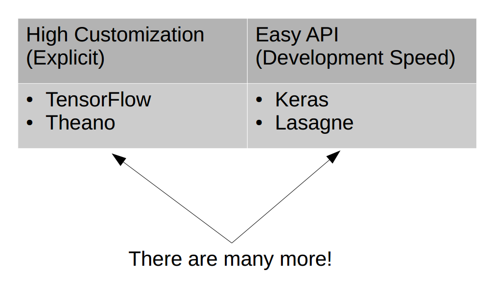
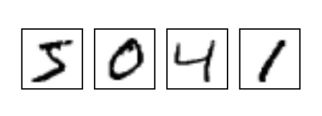

# Neural Networks made Easy
[Interactive Notebook](../mnist_demo.ipynb) 

[Slides](../slides.pdf)
### How to add Neural Nets to your Data Science Toolbox
In many ways neural nets represent the future of machine learning because they can make more "intelligent" decisions than traditional learning algorithms. However the sophistication of these tools tend to make them seem too complicated and inaccessable by even season data scientists. This post will hopefully change your mind and show you that even deep neural nets can be implemented in a matter of minutes.

### What is a neural net and what are those pictures?
A neural net is a machine that takes some input and provides some output. Every neural net has an input layer and output layer, which can be separated by several "hidden" layers. These layers are called hidden because you can not directly observe what is going into or out of them. Some sophisticated neural nets will have several hidden layers which make them fall under the realm of deep learning. This picture shows a not-so-deep neural net with a single hidden layer.

These types of figures are used to illustrate the neural network's architecture which is ultimately responsible for the network's behavior and thus an important thing to think about when constructing your own neural network. 

### What is a neural net doing?

This is a common question and the answer is understandable by anyone. Just like any other machine learning algorithm neural networks take an input vector of features `x` and provide some kind of output `y`. 

The magic behind neural nets is the way they move data between layers. Data is transfered by combining all of the outputs of the left layer in many different ways and sending each of these different combinations to one of the input nodes of the right layer. While training your neural net it will figure out how to combine the inputs to produce the best outputs. This combining operation is facilitated by matrix multiplication and is the foundation for all neural networks. 

By repetitively making combinations of combinations of the inputs a neural network can figure out the higher level structures in the data. This principle is what makes neural networks so powerful. 

### How can I use a neural net?

There are many popular neural network libraries built for python, however the 2 that I will focus on here are `Tensorflow` and `keras`. 

`Tensorflow` is highly customizable and allows the user to get into the nitty gritty of the network's behavior. For example, you can change the way data is transferred between layers, which can be useful for neural net experts. This customizability comes at the cost of development time, and I usually find myself recycling many of the same basic steps, and for the neural network novice many of these steps can be too much of a hurdle. 

This is where `keras` comes in. The `keras` library is built on top of `Tensorflow` and is using `Tensorflow`'s mechanics under the hood, but provides a very simple API that allows you to gloss over many of the canonical steps while building a neural network. This allows you to focus on refining the course grain details of your network while leaving many of the finer grain details to `keras`. The benefit here is that you can build a really complex architecture in less than 10 lines of code.

### MNIST Example

Included in this post is an [`ipython notebook`](../mnist_demo.ipynb) with 3 neural networks using 2 different architectures aimed towards classifying hand written digits. The first 2 neural nets have the same architecture but are implemented first in `Tensorflow` and then in `keras`. These networks have the same behavior and very similar performance, but the `keras` network is developed in half the amount of code. 

The third network is an illustration of what can be developed in `keras` trading line for line with `Tensorflow`. In about 10 lines of code I built a convolutional neural network that approaches state of the art performance for `MNIST`.

